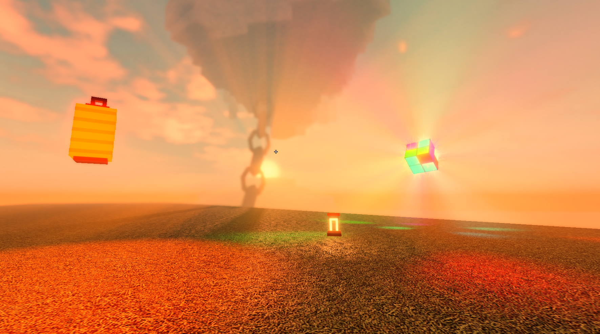

# Shaders for roblox
---

### How to use:
1. *get any executor (pc/mobile, theres no difference)*
2. *paste shader into your executor (script that you copy/download, e. g. "sunset_bright.lua")*
3. *attach and run the script, thats all!*

### Screenshots:
#### Sunset Bright (Fling Things And People):

